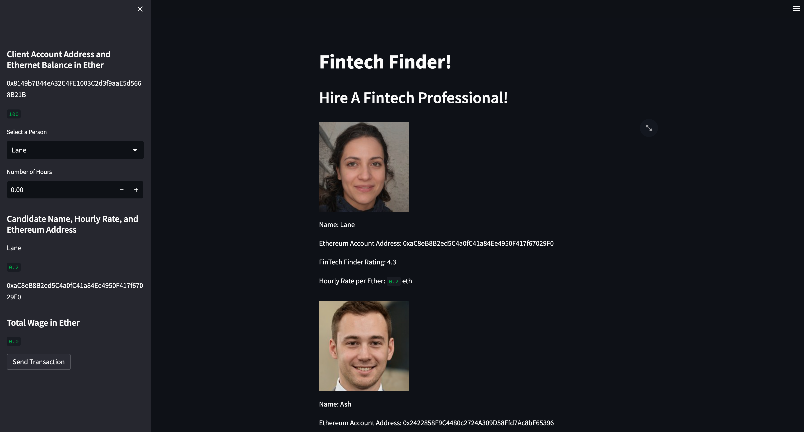
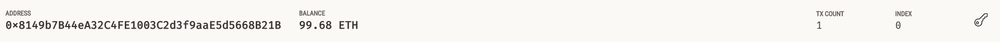
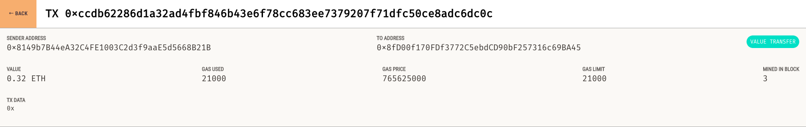

# Crypto Payment System


---

## Description
This application purpose was to develop a crypto payment system. While still in development mode, we are using a testnet instead of real Etherium being transferred, but the functionality is complete.  The payment system is integrated into hiring a Fintech Professional from a list of candidates. When the application is opened using Streamlit, the user lands on the welcome page, which is seen below.


The user can select who they would like to hire in the left panel and the number of hours they will require out of the candidate. The candidate then is shown below with the hourly rate (in Etherium) and the total wage for the job is then displayed below. The user clicks "Send Transaction" when they have decided on who they want to hire, which transfers the Etherium to the wallet address the candidate provided. The transaction hash is then displayed below the "Send Transaction" button. We can see the full process of the app below.


To verify the transaction went through correctly, we can use Ganache, which is our testing platform to see the transaction details. When we first open Ganache, we can see that our account balance is lower (started with 100 Eth).


Then we, can inspect the transaction from the transaciton hash that was passed back to the user when the transaction went through.


We are able to see that our application is fully functional.

---

## Table of Contents
- [Crypto Payment System](#crypto-payment-system)
  - [Description](#description)
  - [Table of Contents](#table-of-contents)
  - [1. Installation](#1-installation)
  - [2. Usage](#2-usage)
  - [3. License](#3-license)
  - [4. Contributing](#4-contributing)
  - [5. Tests](#5-tests)
  - [6. Deployment](#6-deployment)
  - [7. Contact](#7-contact)

---

## 1. Installation

  If you would like to clone the repository, type "git clone https://github.com/kheller18/crypto-payment-system.git". In the terminal, with the Anaconda dev environment activated, install the following packages and dependencies before running the application. To understand how to install these, refer to the [Usage](#2-usage)

  * [dotenv](https://pypi.org/project/python-dotenv/) (1.0.0) - Reads key value pairs in .env

  * [Streamlit](https://streamlit.io/) (1.18.1) - Web interface

  * [Web3](https://web3py.readthedocs.io/en/v5/) (5.17.0) - Python library to interact with Etherium

  * [bip44](https://pypi.org/project/bip44/) (0.1.3) - Creates wallets from mnemonic phrases


---

## 2. Usage

  After cloning the repository locally, you'll need to have the packages listed in [Installation](#1-installation) installed on your machine. To do so, you'll need to activate your conda dev environment and running the following commands:

      ```
      pip install python-dotenv
      pip install streamlit
      pip install web3
      pip install bip44

      ```

  After all of these are installed, please refer to the [Deployment](#6-deployment) section for instructions on how to view or edit the notebook.

---

## 3. License
  ```
  MIT License

  Copyright (c) 2023 Keenan Heller

  Permission is hereby granted, free of charge, to any person obtaining a copy
  of this software and associated documentation files (the "Software"), to deal
  in the Software without restriction, including without limitation the rights
  to use, copy, modify, merge, publish, distribute, sublicense, and/or sell
  copies of the Software, and to permit persons to whom the Software is
  furnished to do so, subject to the following conditions:

  The above copyright notice and this permission notice shall be included in all
  copies or substantial portions of the Software.

  THE SOFTWARE IS PROVIDED "AS IS", WITHOUT WARRANTY OF ANY KIND, EXPRESS OR
  IMPLIED, INCLUDING BUT NOT LIMITED TO THE WARRANTIES OF MERCHANTABILITY,
  FITNESS FOR A PARTICULAR PURPOSE AND NONINFRINGEMENT. IN NO EVENT SHALL THE
  AUTHORS OR COPYRIGHT HOLDERS BE LIABLE FOR ANY CLAIM, DAMAGES OR OTHER
  LIABILITY, WHETHER IN AN ACTION OF CONTRACT, TORT OR OTHERWISE, ARISING FROM,
  OUT OF OR IN CONNECTION WITH THE SOFTWARE OR THE USE OR OTHER DEALINGS IN THE
  SOFTWARE.
  ```
---

## 4. Contributing

  + [Keenan Heller](https://github.com/kheller18)

---

## 5. Tests

  + There are currently no tests associated with this project.

---

## 6. Deployment
  + There is currently no live deployment of this app on a common server. To be able to run this app locally, navigate to the root directory and type "streamlit run fintech_finder.py". This should open the app automatically, but if it doesn't, go to [localhost 8501](http://localhost:8501/) in your browser.

---

## 7. Contact

  + [Keenan's LinkedIn](https://www.linkedin.com/in/keenanheller/)

---